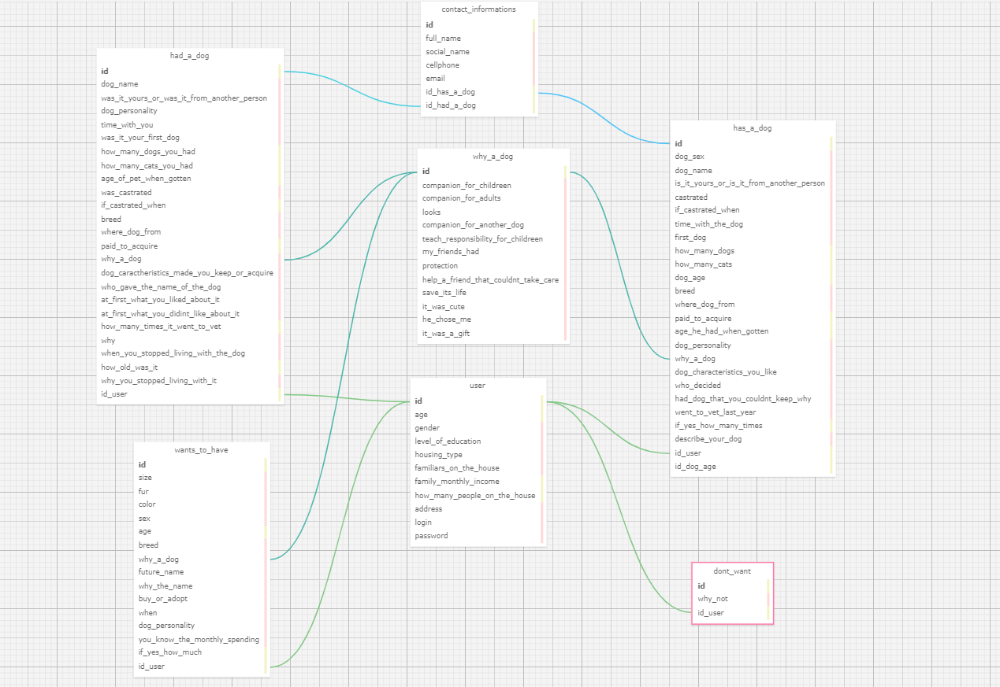

## Documentação Simplificada do Modelo Relacional

**Projeto:** Abandono Zero

**Data:** 2024-05-10

**Autor:** Rafael Rocha Barbosa

**Objetivo:** Descrever o modelo relacional de forma simples para estruturar como os dados serão armazenados dentro do banco de dados, dessa forma, a implementação do site se torna mais clara e fácil.

## Entidades

As entidades guardam todas as informações a respeito do usuário e de suas respostas, elas podem variar entre respostas com textos, múltipla escolha e etc.

- **Usuários** (`users`): Armazena informações básicas do usuário (como email e senha) e, também, as informações preenchidas no formulário resenha (primeiro formulário).

- Atributos:
    - id: `integer` (identificador único do usuário)
    - age: `integer` (idade do usuário)
    - gender `varchar(10)` (genero do usuário)
    - level_of_education `varchar(30)` (nível de escolaridade do usuário)
    - housing_type `varchar(20)` (tipo de moradia do usuário)
    - familiars_on_the_house `varchar(30)` (Constituição familiar na mesma casa do usuário)
    - family_monthly_income `integer` (Renda familiar mensal do usuário)
    - how_many_people_on_the_house `integer` (Quantas pessoas na casa do usuário)
    - address `varchar(50)` (Endereço do usuário)
    - login `varchar(40)` (Login do usuário)
    - password `varchar(30)` (senha do usuário) 

- **Formulários**
  - **Possuir Cão** (`has_a_dog`): Informações sobre o cão que o usuário possui.
    - id: `integer` (identificador único do usuário)
    - dog_name `varchar(20)` (nome do cachorro)
    - dog_sex: `varchar(10)` (sexo do cachorro)
    - is_it_yours_or_is_it_from_another_person: `varchar(30)` (O cachorro pertencia ao usuário ou algum outro membro)
     - castrated `binary` (Descobre se o cachorro é cadastro)
    - if_castrated_when `varchar(20)` (Se foi cadastrado, quando)
    - time_with_the_dog `varchar(20)` (Tempo que o usuário passou com o cachorro)
    - first_dog `binary` (Foi o primeiro cachorro?)
    - how_many_dogs `integer` (Quantos cachorros o usuário tem?)
    - how_many_cats `integer` (Quantos gatos o usuário tem?)
    - dog_age `integer` (Idade do cachorro)
    - breed `varchar(30)` (Raça do cachorro)
    - where_dog_from `varchar(30)` (Onde o cachorro foi adquirido?)
    - paid_to_acquire `integer` (Quanto foi pago pelo cachorro?)
    - age_he_had_when_gotten `integer` (Idade do cachorro quando chegou à casa do usuário)
    - dog_personality `text` (Descreve a personalidade do cachorro)
    - why_a_dog `varchar(100)` (Quantos cachorros o usuário tem?)
    - dog_characteristics_you_like `text` (Caracteristicas do cachorro que o usuário gosta)
    - who_decided `text` (Quem esteve envolvido na decisão de adotar o cachorro)
    - had_dog_that_you_couldnt_keep_why `text` (O usuário teve algum cachorro que não conseguiu ficar? por quê?)
    - went_to_vet_last_year `binary` (O cachorro foi ao veterinário no ultimo ano?)
    - if_yes_how_many_times `integer` (Se sim, quantas vezes?)
    - describe_your_dog `text` (Descreva seu cachorro)

  - **Já Teve Cão** (`had_a_dog`): Informações sobre o cão que o usuário já teve.
    - id: `integer` (identificador único do usuário)
    - dog_name `varchar(20)` (nome do cachorro)
    - dog_sex: `varchar(10)` (sexo do cachorro)
    - is_it_yours_or_is_it_from_another_person: `varchar(30)` (O cachorro pertencia ao usuário ou algum outro membro)
    - time_with_you `integer` (tempo com o usuário)
    - was_it_your_first_dog `binary` (Foi o primeiro cachorro?)
    - how_many_dogs_you_had `integer` (Quantos cachorros o usuário teve?)
    - how_many_cats_you_had `integer` (Quantos gatos o usuário teve?)
    - age_he_had_when_gotten `integer` (Idade do cachorro quando chegou à casa do usuário)
    - castrated `binary` (Descobre se o cachorro foi cadastro)
    - if_castrated_when `varchar(20)` (Se foi cadastrado, quando)
    - breed `varchar(30)` (Raça do cachorro)
    - where_dog_from `varchar(30)` (Onde o cachorro foi adquirido?)
    - paid_to_acquire `integer` (Quanto foi pago pelo cachorro?)
    - why_a_dog `varchar(100)` (Quantos cachorros o usuário tem?)
    - dog_caractheristics_made_you_keep_or_acquire `text` (Caracteristicas que fizeram o usuário adquirir o cachorro)
    - who_gave_the_name_of_the_dog `varchar(30)` (Quem deu o nome do cachorro?)
    - at_first_what_you_liked_about_it `text` (O que o usuário gostou no cachorro no primeiro contato?)
    - at_first_what_you_didnt_liked_about_it `text` (O que o usuário não gostou no cachorro no primeiro contato?)
    - how_many_times_it_went_to_vet `integer` (Quantas vezes o cachorro foi ao veterinário?)
    - why `tex` (por quê?)
    - when_you_stopped_living_with_the_dog `varchar(50)` (Quando o usuário deixou de viver com o cachorro?)
    - how_old_was_he `integer` (Qual era a idade do cachorro?)

  - **Deseja Cão** (`want_to_have`): Informações sobre o cão que o usuário deseja ter.
    - size `varchar(30)` (Tamanho)
    - fur `varchar(30)` (Pelagem)
    - color `varchar(30)` (Cor)
    - sex `varchar(30)` (Sexo)
    - age `integer` (Idade)
    - breed `varchar(30)` (Raça?)
    - why_a_dog `text` (Por que um cachorro?)
    - future_name `varchar(30)` (Nome futuro)
    - why_the_name `text` (Por que esse nome?)
    - buy_or_adopt `binary` (Comprar ou adotar?)
    - when `varchar(30)` (Quando pretende adquirir?)
    - dog_personality `text` (Personalidade)
    - you_know_the_monthly_spending `binary` (O usuário sabe quanto ele vai gastar por mês com o cachorro?)
    - if_yes_how_much `integer` (Se ele sabe, quanto?)

  - **Sem Cão** (`dont_want`): Motivo pelo qual o usuário não tem e não deseja ter um cão.
    - why_not `text` (Por que não ter um cachorro?)

    - **Contato** (`contact_informations`): Dados para contato futuro com o usuário.
    - full_name `varchar(40)` (nome completo do usuário)
    - social_name `varchar(20)` (nome social do usuário)
    - cellphone `varchar(15)` (número de celular do usuário)
    - email `varchar(30)` (email do usuário)

- - **Motivos para ter um cão** (`why_a_dog`): Motivos pelos quais o usuário deseja ter um cachorro.
    - companion_for_childreen `binary` (Companhia para crianças)
    - companion_for_adults `binary` (Companheia para adultos)
    - looks `binary` (Aparência)
    - companion_for_another_dog `binary` (Companhia para outro cachorro)
    - teach_responsibility_for_childreen `binary` (Ensinar responsabilidade para crianças)
    - my_friends_had `binary` (Meus amigos tinham)
    - protection `binary` (Proteção)
    - help_a_friend_that_couldnt_take_care `binary` (Ajudar um amigo que não podia cuidar)
    - save_its_life `binary` (Salvar sua vida)
    - it_was_cute `binary` (Era fofo)
    - he_chose_me `binary` (Ele me escolheu)
    - it_was_a_gift `binary` (Foi um presente)

    Essa entidade representa as opções que o usuário pode marcar na pergunta "why a dog?"

## Relacionamentos

- Um usuário pode ter vários formulários de cães (1:N).
- Um formulário de "possuir cão" pode ter um vários usuários (1:N)".
- Um formulário de "possuia cão" pode ter um vários usuários (1:N)".
- Um formulário de "possuirá cão" pode ter um vários usuários (1:N)".
- Um formulário de "Não quer cão" pode ter um vários usuários (1:N)".
- O formulário de "possuir cão" se relaciona com o contact_informations (1:1)".
- O formulário de "possuia cão" se relaciona com o contact_informations (1:1)".
- Os formulários de possuir, possuia ou possuirá cão se relaciona com a tabela "why_a_dog" (1:1)

## Regras de Negócio

- Todos os campos obrigatórios devem ser preenchidos, mas o usuário pode selecionar a opção de prefere não responder.
- As informações devem ser consistentes entre os formulários.
- Os usuários poderão editar informações já salvas.
- As informações dos usuários são confidenciais.

## Diagrama

Figura 1 - Modelo Relacional

Fonte: Material produzido pelo autor (2024)

## Considerações Finais

Este modelo relacional simplificado fornece uma base para o gerenciamento eficiente das informações dos usuários e suas respostas nos formulários do projeto Abandono Zero. As entidades, seus atributos e relacionamentos garantem a organização e a integridade dos dados. As regras de negócio garantem a consistência e a confiabilidade das informações.

**Observações:**

- Este modelo é uma versão simplificada e pode ser adaptado às necessidades específicas do projeto.
- É importante se atentar a agilidade que o modelo relacional traz ao código e adaptá-lo, caso necessário.